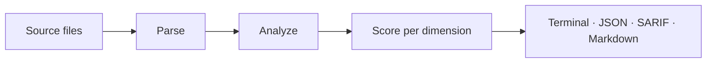

<p align="center">
  <picture>
    <source media="(prefers-color-scheme: dark)" srcset="https://raw.githubusercontent.com/shubhamkaushal765/zuit/main/docs/static/img/logo-dark.svg">
    
  </picture>
</p>

<p align="center">
  <strong>See what's wrong with your code — across 9+ quality dimensions, in one command, deterministically.</strong>
</p>

<p align="center">
  A linter that grades your code like a teacher who actually read it. Rust, Python, JS, TS. No telemetry. No JVM.
</p>

<p align="center">
  <a href="https://crates.io/crates/zuit"></a>
  <a href="https://pypi.org/project/zuit/"></a>
  <a href="https://www.npmjs.com/package/zuit"></a>
  <a href="https://github.com/shubhamkaushal765/zuit/actions/workflows/ci.yml"></a>
  <a href="https://shubhamkaushal765.github.io/zuit/"></a>
  <a href="https://github.com/shubhamkaushal765/zuit/blob/main/LICENSE"></a>
</p>

---



## What is zuit

zuit scans your Rust, Python, and JavaScript/TypeScript source files and reports findings grouped into named quality dimensions, each with an independent 0–100 score and an A–F grade. There is no single composite score — you decide which dimensions matter for your project and enforce only those.

Three moments where it earns its place: a pre-commit hook (`zuit install-hook`) and LSP server (`zuit lsp`) catch problems before they ever touch CI; `--fail-on` lets you gate builds per dimension (fail on Security below 95, ignore Documentation for now); and `zuit show` opens a local browser dashboard with Trends, Diff, and Heatmap views across every scan you've run — no external service involved. For the full story, see the [docs](https://shubhamkaushal765.github.io/zuit/).

## Install

```bash
# Rust
cargo install --locked zuit
```

```bash
# Python
pip install zuit
```

```bash
# Node
npm install -g zuit
```

```yaml
# GitHub Action — .github/workflows/zuit.yml
- uses: shubhamkaushal765/zuit@main
  with:
    path: "."
    fail-on: "medium"
```

The pip and npm packages are launchers: they resolve a `zuit` binary via `ZUIT_BIN`, a bundled binary, or your OS PATH — install the cargo crate to get the binary, or point `ZUIT_BIN` at one you already have.

## First scan

```bash
zuit analyze .
```

```text
[MAINT001-cyclomatic] medium  src/lib.rs:42:1
  function `process_request` has cyclomatic complexity 14 (threshold 10)

Maintainability  87.4  B
Security         98.1  A
Complexity      100.0  A
Documentation    73.5  C
TestSmell        91.0  A
```

Output is sorted by (file, span, rule_id) — two runs on unchanged source produce identical output. See the [quickstart](https://shubhamkaushal765.github.io/zuit/quickstart) for the full walkthrough.

## Quality dimensions

| Dimension       | What it catches                                                | Example rule                   |
| --------------- | -------------------------------------------------------------- | ------------------------------ |
| Security        | Hardcoded secrets, eval sinks, unsafe memory patterns          | `SEC001-hardcoded-secret`      |
| Maintainability | Long functions, deep nesting, high cyclomatic complexity       | `MAINT001-cyclomatic`          |
| Complexity      | Fan-out, cyclic deps, duplicate code across files              | `CPLX001-fan-out`              |
| Documentation   | Undocumented public APIs, unresolved TODO/FIXME comments       | `DOC001-public-api-undoc`      |
| Test smell      | No-assert tests, skipped tests, flaky time comparisons         | `TEST002-no-asserts`           |
| Supply chain    | Typosquatted deps, missing lockfiles, stale transitives        | `CHAIN002-typosquat-suspicion` |
| Packaging       | Missing type declarations, dual-package hazards, unpinned deps | `PKG002-missing-types`         |
| Performance     | Oversized bundles, heavy top-level imports                     | `PERF001-bundle-size`          |
| Health          | Bus factor, stale releases, missing changelog                  | `HEALTH001`                    |

Three more dimensions (ecosystem, CI, soundness) fire for Rust crates — see the full [Dimensions reference](https://shubhamkaushal765.github.io/zuit/concepts/dimensions).

## Languages

| Language                | Status | Extensions                                                   |
| ----------------------- | ------ | ------------------------------------------------------------ |
| Rust                    | Full   | `.rs`                                                        |
| Python                  | Full   | `.py`                                                        |
| JavaScript / TypeScript | Full   | `.js`, `.mjs`, `.cjs`, `.jsx`, `.ts`, `.mts`, `.cts`, `.tsx` |
| Go                      | Stub   | Not yet supported                                            |

## Output formats

- **Terminal** — colour-coded findings with OSC-8 hyperlinks, A–F grades per dimension
- **JSON** — machine-readable, pipe-friendly
- **SARIF 2.1.0** — upload to GitHub code scanning for inline PR annotations
- **Markdown** — drop into a PR comment or wiki page
- **Checkstyle XML** — compatible with tools that consume Checkstyle reports
- **JUnit XML** — compatible with CI systems that consume JUnit reports

Every finding carries CWE and OWASP taxonomy tags, filterable via `--cwe` and `--owasp`.

## Why zuit

### Deterministic

Run it twice on unchanged source, get byte-identical output. Findings are sorted by (file, span, rule_id), so diffs are clean and baselines are stable.

### Offline — no telemetry

Everything runs on your machine — analysis, scoring, and the `zuit show` history dashboard. Nothing is sent anywhere.

### Native Rust parsers

`syn` for Rust, `rustpython-parser` for Python, `oxc_parser` for JS/TS. No JVM, no Node startup tax — the binary starts and finishes before your coffee cools.

## What's next

- [Quickstart](https://shubhamkaushal765.github.io/zuit/quickstart)
- [Daily dev loop](https://shubhamkaushal765.github.io/zuit/workflows/daily-dev-loop)
- [Gate CI on quality](https://shubhamkaushal765.github.io/zuit/workflows/gate-ci)
- [Adopt on a legacy codebase](https://shubhamkaushal765.github.io/zuit/workflows/adopt-legacy)
- [Track trends across releases](https://shubhamkaushal765.github.io/zuit/workflows/track-trends)
- [All rules](https://shubhamkaushal765.github.io/zuit/rules/)

## Contributing

The extending guides cover the common entry points:
[Add a language](https://shubhamkaushal765.github.io/zuit/extending/add-a-language),
[Add an analyzer](https://shubhamkaushal765.github.io/zuit/extending/add-an-analyzer),
[Write a plugin](https://shubhamkaushal765.github.io/zuit/extending/plugins).
File issues and pull requests on [GitHub](https://github.com/shubhamkaushal765/zuit).

## License

MIT — see [LICENSE](https://github.com/shubhamkaushal765/zuit/blob/main/LICENSE).
