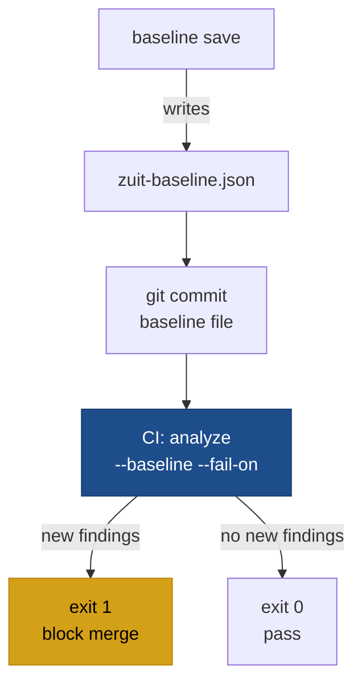

:::tip Looking for the recipe?
See [Workflows → Adopt on a legacy codebase](/workflows/adopt-legacy) for the task-driven guide. This page is the reference.
:::

# zuit baseline

```
zuit baseline save [OPTIONS] [PATH]
```

Captures the current findings as a `zuit-baseline.json` file. Use the baseline file with `zuit analyze --baseline` to suppress pre-existing issues, so only **new** findings trigger `--fail-on`.

## Subcommands

| Subcommand      | Effect                                          |
| --------------- | ----------------------------------------------- |
| `baseline save` | Run analysis and write findings to a JSON file. |

## Flags

| Flag              | Type   | Default                  | Description                                                                                                        |
| ----------------- | ------ | ------------------------ | ------------------------------------------------------------------------------------------------------------------ |
| `--ref <GIT_REF>` | string | unset (working tree)     | Capture findings from a git ref (tag, branch, or commit SHA). Uses `git archive | tar -x` into a temporary directory. |
| `-o <FILE>`       | path   | `zuit-baseline.json`     | Write the baseline to this file instead of the default.                                                           |
| `--config <FILE>` | path   | auto                     | Path to a `zuit.toml`. Overrides the default upward search.                                                       |
| `[PATH]`          | path   | `.`                      | Root path to analyse.                                                                                              |

## Examples

Capture the baseline from the working tree:

```bash
zuit baseline save
```

Capture the baseline from a released tag:

```bash
zuit baseline save --ref v1.0.0 -o baseline-v1.0.0.json
```

Apply the baseline to suppress pre-existing issues in CI:

```bash
zuit analyze . --baseline zuit-baseline.json --fail-on high
```

## Workflow



1. Capture a baseline on the current state of the codebase:

   ```bash
   zuit baseline save -o zuit-baseline.json
   git add zuit-baseline.json
   git commit -m "chore: zuit baseline"
   ```

2. In CI and local runs, apply the baseline:

   ```bash
   zuit analyze . --baseline zuit-baseline.json --fail-on medium
   ```

3. Refresh the baseline periodically as legacy findings are fixed:

   ```bash
   zuit baseline save -o zuit-baseline.json
   ```

## See also

- [Baselines and fail-on](/configuration/baselines-and-fail-on)
- [`zuit analyze`](/cli/analyze)
- [`zuit diff`](/cli/diff)
