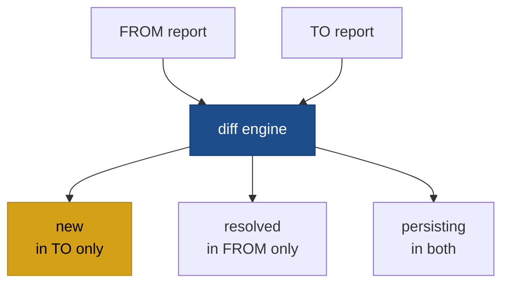

:::tip Looking for the recipe?
See [Workflows → Track trends across releases](/workflows/track-trends) for the task-driven guide. This page is the reference.
:::

# zuit diff

```
zuit diff <FROM> <TO>
```

Use `zuit diff` to compare two analysis results and see exactly what changed: which findings are new, which were resolved, and which are still present. Both arguments can be paths to JSON report files saved with `zuit analyze --format json`, or scan IDs from your saved scan history.

## When to use this

- Review the quality impact of a pull request before merging.
- Confirm that a fix actually resolved a reported finding.
- Detect regressions between two releases or branches.



## Arguments

| Argument | Description                                              |
| -------- | -------------------------------------------------------- |
| `<FROM>` | Baseline report: path to a JSON file produced by `zuit analyze --format json`. |
| `<TO>`   | Comparison report: path to a JSON file produced by `zuit analyze --format json`. |

> **Status:** Passing scan IDs (instead of file paths) is not yet implemented in zuit. Both arguments must be paths to JSON files produced by `zuit analyze --format json`.

## Output

The diff groups findings into three sets:

| Set          | Meaning                                                   |
| ------------ | --------------------------------------------------------- |
| `new`        | Findings in `<TO>` but not in `<FROM>`                    |
| `resolved`   | Findings in `<FROM>` but not in `<TO>` (fixed or removed) |
| `persisting` | Findings present in both reports                          |

Two findings are considered the same if they share the same rule ID and file. Minor line-number drift (e.g. from reformatting) does not cause a finding to appear as new.

## Options

| Flag                | Default | Description                        |
| ------------------- | ------- | ---------------------------------- |
| `--format <FORMAT>` | `json`  | Output format: `json` or `terminal`. |
| `-h`, `--help`      |         | Print help.                        |

## Examples

Diff two saved JSON files:

```bash
zuit diff baseline.json current.json
```

Diff two saved JSON files using scan IDs is not yet supported — use file paths for both arguments.

## See also

- [`zuit analyze`](/cli/analyze)
- [`zuit baseline`](/cli/baseline)
- [`zuit show`](/cli/show)
