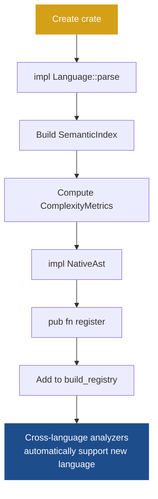

# Add a language frontend

You want zuit to support a new language. This guide walks you through creating a `zuit-lang-X` crate that teaches zuit how to parse and index source files for that language. Once you're done, every existing cross-language analyzer automatically supports the new language — no changes to those crates required.

The example throughout is a Ruby frontend. Use the existing [`zuit-lang-rust`](https://github.com/shubhamkaushal765/zuit/blob/main/crates/zuit-lang-rust/) and [`zuit-lang-python`](https://github.com/shubhamkaushal765/zuit/blob/main/crates/zuit-lang-python/) crates as models.

**The two-axis rule:** language crates and `zuit-analyzers` never depend on each other. Language crates teach zuit to parse; analyzer crates teach it to detect problems. The CLI is the only crate that depends on both. This boundary is enforced at the Cargo dependency-graph level.



## Checklist

1. [Create the crate](#step-1--create-the-crate-with-workspace-inheritance)
2. [Implement `Language::parse`](#step-2--implement-languageparse-using-a-native-rust-parser)
3. [Build a `SemanticIndex`](#step-3--build-a-semanticindex-from-the-ast)
4. [Compute `ComplexityMetrics`](#step-4--compute-complexitymetrics-per-function)
5. [Implement `NativeAst`](#step-5--implement-nativeast-for-rubyast)
6. [Optionally add language-specific analyzers](#step-6--optionally-add-language-specific-analyzers)
7. [Expose `pub fn register`](#step-7--expose-pub-fn-register)
8. [Wire into `build_registry()`](#step-8--wire-into-build_registry)

---

## Step 1 — Create the crate with workspace inheritance

Create `crates/zuit-lang-ruby/Cargo.toml`. Using `workspace = true` for `version` and `edition` means your crate automatically stays in sync with every other zuit crate — you never have to update these manually:

```toml
[package]
name    = "zuit-lang-ruby"
version.workspace = true
edition.workspace = true

[dependencies]
zuit-core.workspace = true
# your chosen Ruby parser crate (e.g. `lib-ruby-parser`)
```

Then add `"crates/zuit-lang-ruby"` to the `[workspace] members` list in the root `Cargo.toml`.

---

## Step 2 — Implement `Language::parse` using a native Rust parser

Define a `RubyLanguage` struct and implement [`zuit_core::Language`](https://github.com/shubhamkaushal765/zuit/blob/main/crates/zuit-core/src/language.rs). This tells zuit which file extensions to hand to your parser and how to turn source text into a `ParsedFile`. The `id` and `extensions` methods are what zuit uses to route `.rb` files to your crate — nothing else needs to know the mapping:

```rust
pub struct RubyLanguage;

impl Language for RubyLanguage {
    fn id(&self) -> LanguageId { LanguageId("ruby") }
    fn extensions(&self) -> &[&'static str] { &["rb"] }
    fn parse(&self, source: Arc<SourceFile>) -> Result<ParsedFile, ParseError> {
        parse::parse(source)
    }
}
```

Model the `parse` function on [`zuit-lang-rust/src/parse.rs`](https://github.com/shubhamkaushal765/zuit/blob/main/crates/zuit-lang-rust/src/parse.rs) or [`zuit-lang-python/src/parse.rs`](https://github.com/shubhamkaushal765/zuit/blob/main/crates/zuit-lang-python/src/parse.rs). Map parser errors to [`ParseError::Syntax`](https://github.com/shubhamkaushal765/zuit/blob/main/crates/zuit-core/src/error.rs).

---

## Step 3 — Build a `SemanticIndex` from the AST

Create `src/index.rs`. Walk your parser's AST and emit normalized entries into a `SemanticIndex`. This is what cross-language analyzers read — they never touch the native AST. The full struct definitions are in [`zuit-core/src/index.rs`](https://github.com/shubhamkaushal765/zuit/blob/main/crates/zuit-core/src/index.rs).

Entry types to emit:

- `FunctionLike` — every function and method (with visibility and span)
- `TypeDecl` — type, struct, and interface declarations
- `Import` — import statements
- `StringLit` — string literals (used by secret-detection rules)
- `DocComment` — doc comments attached to public items

**Contract:** every public function or method must produce a `FunctionLike` with `visibility: Visibility::Public` and a populated `ComplexityMetrics`. This is what `MAINT001-cyclomatic` and `DOC001-public-api-undoc` read.

Reference implementations: [`zuit-lang-rust/src/index.rs`](https://github.com/shubhamkaushal765/zuit/blob/main/crates/zuit-lang-rust/src/index.rs) and [`zuit-lang-python/src/index.rs`](https://github.com/shubhamkaushal765/zuit/blob/main/crates/zuit-lang-python/src/index.rs).

---

## Step 4 — Compute `ComplexityMetrics` per function

Create `src/complexity.rs`. For each function, compute four metrics that the complexity and maintainability analyzers rely on:

| Metric        | How to compute                                                              |
| ------------- | --------------------------------------------------------------------------- |
| `cyclomatic`  | Baseline 1, +1 per branch (`if`, `for`, `select`, `&&`, `||`, etc.)        |
| `cognitive`   | Sonar-style: +1 per branch, +1 more for each level of nesting               |
| `max_nesting` | The deepest nesting depth reached in the function body                      |
| `returns`     | Count of explicit `return` statements                                       |

See [`zuit-lang-rust/src/complexity.rs`](https://github.com/shubhamkaushal765/zuit/blob/main/crates/zuit-lang-rust/src/complexity.rs) for a complete reference implementation.

---

## Step 5 — Implement `NativeAst` for `RubyAst`

Define a struct that holds whatever data Ruby-specific analyzers will need — this is passed alongside the `SemanticIndex` but is only accessible to analyzers that explicitly ask for it by type. This separation means cross-language analyzers are never exposed to Ruby-specific internals.

**Critical:** the struct must be `Send + Sync`. If your parser uses `Rc` internally, extract the data you need into owned values and drop the parser's AST before constructing `RubyAst`:

```rust
pub(crate) struct RubyAst {
    // pre-extracted data needed by Ruby-specific analyzers
    pub(crate) something: Vec<SomePlainType>,
}

impl NativeAst for RubyAst {
    fn as_any(&self) -> &dyn Any { self }
}
```

Also provide a typed accessor so language-specific analyzers don't have to downcast manually. This is the function Ruby-specific analyzers will call instead of working with raw `dyn Any`:

```rust
pub(crate) fn try_ruby_ast(parsed: &ParsedFile) -> Option<&RubyAst> { /* ... */ }
```

This follows the same pattern as `try_rust_ast` in [`zuit-lang-rust/src/lib.rs`](https://github.com/shubhamkaushal765/zuit/blob/main/crates/zuit-lang-rust/src/lib.rs).

---

## Step 6 — Optionally add language-specific analyzers

If you want rules that only make sense for Ruby (e.g. detecting misuse of `eval`), create `src/analyzers/mod.rs` and `src/analyzers/my_rule.rs`. Implement [`zuit_core::Analyzer`](https://github.com/shubhamkaushal765/zuit/blob/main/crates/zuit-core/src/analyzer.rs) with `supported_languages()` returning `SupportedLanguages::Only(&[LanguageId("ruby")])`, and use `try_ruby_ast(file)` to access the `RubyAst`.

See [`zuit-lang-rust/src/analyzers/unsafe_block.rs`](https://github.com/shubhamkaushal765/zuit/blob/main/crates/zuit-lang-rust/src/analyzers/unsafe_block.rs) for a complete example.

---

## Step 7 — Expose `pub fn register`

In `src/lib.rs`, expose a single `register` function that adds the language (and any language-specific analyzers) to the shared registry. This is the only public entry point your crate needs — `zuit-registry` calls it once at startup and everything else follows automatically:

```rust
pub fn register(registry: &mut Registry) {
    registry.add_language(Box::new(RubyLanguage));
    // add any language-specific analyzers:
    registry.add_analyzer(Box::new(analyzers::my_rule::MyAnalyzer));
}
```

Reference: [`zuit-lang-rust/src/lib.rs`](https://github.com/shubhamkaushal765/zuit/blob/main/crates/zuit-lang-rust/src/lib.rs) and [`zuit-lang-python/src/lib.rs`](https://github.com/shubhamkaushal765/zuit/blob/main/crates/zuit-lang-python/src/lib.rs).

---

## Step 8 — Wire into `build_registry()`

Add the new crate as a dependency of `zuit-registry`, which is shared by both the CLI and the LSP server. This is the only place you touch outside your new crate:

```toml
# crates/zuit-registry/Cargo.toml
zuit-lang-ruby = { path = "../zuit-lang-ruby" }
```

Then call `register` in [`zuit-registry/src/lib.rs`](https://github.com/shubhamkaushal765/zuit/blob/main/crates/zuit-registry/src/lib.rs):

```rust
zuit_lang_ruby::register(&mut registry);
```

No changes to `zuit-core`, `zuit-analyzers`, or any other language crate are needed. Cross-language analyzers automatically support Ruby because they read the `SemanticIndex` that your new frontend populates.

---

## Verify your work

```bash
cargo build --workspace && cargo test --workspace
```
