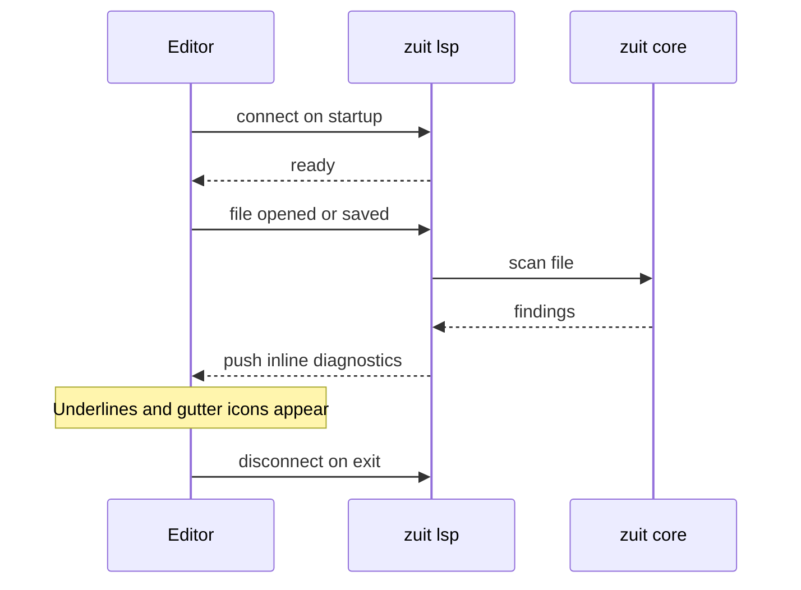

:::tip Looking for the recipe?
See [Workflows → Your daily dev loop](/workflows/daily-dev-loop) for the task-driven guide. This page is the reference.
:::

# LSP integration

Run `zuit lsp` to start a language server that delivers inline diagnostics to your editor. When you save a file, zuit re-scans it and shows findings directly in your editor as underlines or gutter icons — no separate terminal window needed.

Supported file types: Rust, Python, JavaScript, and TypeScript.

## How it works



Each time you open or save a file, the language server runs a full scan and pushes the results back to your editor as standard LSP diagnostics. No configuration beyond the snippets below is required.

## Severity display

| zuit severity | Typical editor display        |
| ----------------- | ----------------------------- |
| `critical`        | Red underline / error icon    |
| `high`            | Red underline / error icon    |
| `medium`          | Yellow underline / warning    |
| `low`             | Blue underline / info         |
| `info`            | Dotted underline / hint       |

## Editor setup

### VS Code

Install any generic LSP client extension (for example **"LSP client"** from the VS Code Marketplace) and add this to your `settings.json`:

```json
"lspClient.servers": [
  {
    "name": "zuit",
    "command": ["zuit", "lsp"],
    "filetypes": ["rust", "python", "javascript", "typescript"]
  }
]
```

### Neovim

Add to your Neovim config (works without `nvim-lspconfig`):

```lua
vim.api.nvim_create_autocmd("FileType", {
  pattern = { "rust", "python", "javascript", "typescript", "javascriptreact", "typescriptreact" },
  callback = function()
    vim.lsp.start({
      name = "zuit",
      cmd = { "zuit", "lsp" },
      root_dir = vim.fs.dirname(
        vim.fs.find(
          { "zuit.toml", "Cargo.toml", "pyproject.toml", "package.json" },
          { upward = true }
        )[1]
      ),
    })
  end,
})
```

If you use `nvim-lspconfig`, add `zuit` as a custom server pointing to the same command.

### Helix

Add to `~/.config/helix/languages.toml`:

```toml
[language-server.zuit-lsp]
command = "zuit"
args = ["lsp"]

[[language]]
name = "rust"
language-servers = ["zuit-lsp"]

[[language]]
name = "python"
language-servers = ["zuit-lsp"]

[[language]]
name = "javascript"
language-servers = ["zuit-lsp"]

[[language]]
name = "typescript"
language-servers = ["zuit-lsp"]
```

### Zed

Add to your Zed `settings.json` under `"lsp"`:

```json
"lsp": {
  "zuit": {
    "binary": {
      "path": "zuit",
      "arguments": ["lsp"]
    }
  }
}
```

Then associate it with the file types you want in your Zed language settings.

## Known limitations

- Each save triggers a full re-scan of the file; the incremental cache used by `zuit analyze` is not available in LSP mode.
- Code actions, hover documentation, and workspace symbol search are not yet supported.

## See also

- [`zuit lsp` reference](/cli/lsp)
- [`zuit watch`](/cli/watch)
