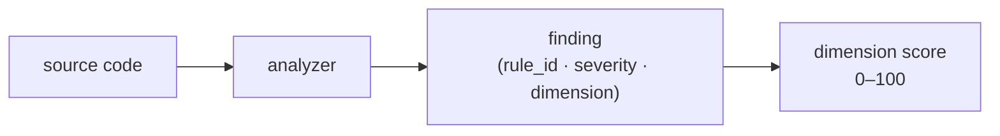

import PipelineDiagram from '@site/src/components/diagrams/PipelineDiagram';

# Welcome to zuit

Your code has problems — security risks, tech debt, tests that don't actually test. zuit finds them across 9+ quality dimensions, in one command. Deterministically: two runs against unchanged source produce byte-identical output.

<PipelineDiagram />

## Three concrete value moments

**Catch the hardcoded secret before commit.** A pre-commit hook (`zuit install-hook`) blocks bad commits locally. The LSP server (`zuit lsp`) underlines findings in your editor as you save. Neither requires a CI round-trip — the feedback loop stays on your machine.

**Gate CI on quality, dimension by dimension.** Fail builds when the Security score drops below 95 while letting Documentation slip — each dimension scores independently, so you can enforce the standards that matter for your project without blocking on ones that don't.

**Track quality across releases.** Every scan is saved locally. `zuit show` opens a browser dashboard with Trends, Diff, and Heatmap views to see whether quality is improving sprint over sprint. No external service, no data leaving your machine.

## Quality dimensions

Instead of a flat list of warnings, zuit groups every finding into a named dimension and gives each an independent score. Nine dimensions are user-facing; three more (ecosystem, CI, soundness) fire on Rust crates.

| Dimension       | What it measures                                                    |
| --------------- | ------------------------------------------------------------------- |
| Security        | Patterns commonly exploited by attackers                            |
| Maintainability | How easy the code is to read and change                             |
| Complexity      | Project-level structural complexity (fan-out, cycles)               |
| Documentation   | Public-API doc coverage and TODO/FIXME inventory                    |
| Test smell      | Quality of the tests themselves                                     |
| Supply chain    | Dependency provenance, typosquatting, lockfiles, stale transitives  |
| Packaging       | Package metadata correctness and consumer usability                 |
| Performance     | Bundle size, heavy imports, runtime overhead                        |
| Health          | Repository health (bus factor, release cadence, changelog)          |

:::note
Each dimension produces an independent 0–100 score — there is no single composite. CI gates per dimension, so you can enforce a Security floor without blocking on Documentation. Some dimensions only fire when the relevant language frontend is enabled (e.g. ecosystem / CI / soundness are Rust-specific).
:::

See [Dimensions](/concepts/dimensions) for the full rule list and [Severity and scoring](/concepts/severity-and-scoring) for how scores are calculated.

## Languages supported

| Language                | Status | Notes                                                                          |
| ----------------------- | ------ | ------------------------------------------------------------------------------ |
| Rust                    | Full   | Built-in                                                                       |
| Python                  | Full   | Built-in                                                                       |
| JavaScript / TypeScript | Full   | Built-in; covers `.js`, `.mjs`, `.cjs`, `.jsx`, `.ts`, `.mts`, `.cts`, `.tsx` |
| Go                      | Stub   | Not yet supported                                                              |

## Where to next

- [Quickstart](/quickstart) — install, first scan, and reading the output in five minutes
- [Workflows: Daily dev loop](/workflows/daily-dev-loop) — watch mode, LSP, and inline suppression
- [Concepts: Dimensions](/concepts/dimensions) — how the five dimensions are defined and scored
